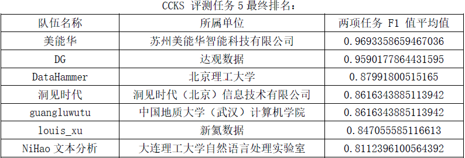
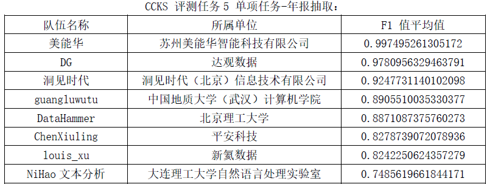
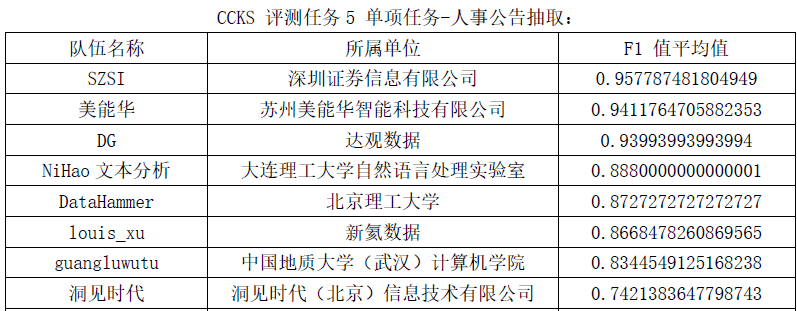

# CCKS2019-Task5

## 引言  
 目前，PDF已成为电子文档发行和数字化信息传播的一个标准，其广泛应用于学术界的交流以及各类公告的发行。如何从非结构化的PDF文档中抽取结构化数据是知识图谱领域所面临的一大挑战。本文利用Adobe公司开发的Acrobat DC SDK对PDF进行格式转换，从半结构化的中间文件进行信息抽取。相比已有的开源PDF解析方法，Acrobat导出的中间文件保存了更完整更准确的表格和文本段落信息，能应用于不同需求的信息抽取任务。  在CCKS 2019公众公司公告评测中，我们的方法获得总成绩第三名。在本次评测中，我们将公告文件（PDF格式）转换成XML。对于任务一，我们通过查找Table标签，获取PDF中所有的表格；然后根据表格的上下文，确定其名称，抽出符合条件的表格。对于任务二，我们首先抽出所有文本段落，使用Bi-LSTM-CRF进行命名实体识别，最后结合规则抽取信息点。

## 任务相关  

1. [任务描述](https://biendata.com/competition/ccks_2019_5/ )

2. 训练数据  
	网盘链接：[https://pan.baidu.com/s/1ali_-IHCCrxlLBkMm0gmGA](https://pan.baidu.com/s/1ali_-IHCCrxlLBkMm0gmGA)  
	提取码：y4t5

## 基于Acrobat DC SDK的PDF内容抽取系统
该部分为独立组件，项目地址为：[https://github.com/houking-can/PDFConverter](https://github.com/houking-can/PDFConverter)

## 解决方案
### 子任务1：表格抽取
将PDF转为XML后，直接解析XML抽取表格
### 子任务2：高管离职信息点抽取
1. 将PDF转为XML，抽取出文本段落，分句，使用人工标注的JSON反标数据，得到BIO训练数据。
2. 词向量: 本次比赛使用金融领域预训练好的[词向量](https://github.com/Embedding/Chinese-Word-Vectors)
3. 训练Bi-LSTM-CRF直至收敛
4. 根据触发词，如离职，辞职，因...原因等，设计模板，先识别具有信息点的句子，然后对该句进行实体识别，抽出信息点

## 分数与排名
### 两项任务总排名

### 子任务1

### 子任务2

### 说明
- 在子任务1——表格抽取任务中，由于PDF内容抽取参数设置不当，有1个测试用例输出为空（共10个用例），这严重影响了我们在这个任务中的表现，本来F1值可以达到0.96左右（理论值可达到0.99，忽略空格以及不区分0和0.00）。本次评测是使用web api方式进行评测，最终结果只测试一次，因此没有再次修改的机会。
- 在子任务2——高管信息抽取中，前两名公司都采用了人工标注得到BIO训练数据，深圳证券还使用额外数据。我们只使用启发式规则标注数据，存在大量噪声。前几名基本都使用BERT，效果提升很大，我们只单纯使用预训练好的词向量。